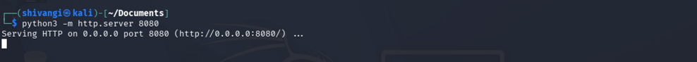
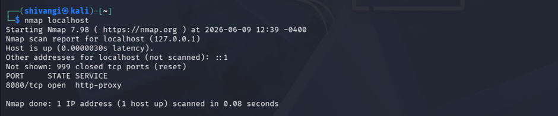
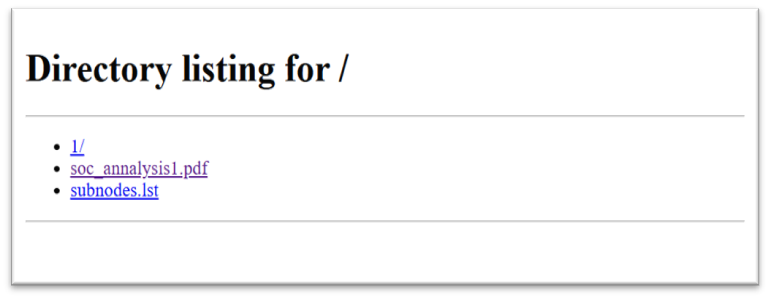
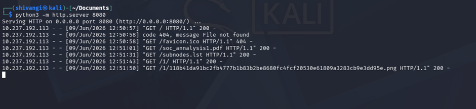

                            Throwing Up a Quick Web Server with Python

What is this concept?
When you are working inside a network (or a lab setup), you often need a quick, no-fuss way to share files between two machines. Instead of messing around with USB drives, complex shared folders, or setting up a massive enterprise web server, you can turn any terminal folder into an instant downloadable website using a single built-in Python command.

How it Works

1. Spinning up the Server
On your host machine (shivangi@kali), you navigate to the folder containing your files (like documents, scripts, or exfiltrated data) and run:
python3 -m http.server 8080
 
This instantly turns that specific folder into a local website. The machine starts "listening" on port 8080 for anyone asking for files.

2. Double-Checking the Port
To make sure it's actually alive and running locally, you can run an nmap scan against your own machine (localhost):
nmap localhost
 
The scan shows that port 8080/tcp is open and running an http-proxy or standard HTTP web service.

3. What the Target Sees
When another machine on the network navigates to your IP address on a web browser they don't see a fancy web page. They see a bare-bones Directory Listing—essentially a clickable menu of everything inside your folder (like soc_analysis1.pdf or subnodes.lst). They can simply click these links to download them immediately.
 

4. The Analyst’s/Attacker's View (The Logs)
Back on your terminal, Python acts as a mini-log recorder, showing you exactly who is downloading what in real time:
 
•	You see their standard web browser requests (like GET /soc_analysis1.pdf HTTP/1.1).
•	You see the server respond with an HTTP 200 (Success code) indicating the file transfer went through perfectly.

Why this is a crucial concept to know:
•	For Attackers (Data Exfiltration & Tool Dropping): Once an attacker breaks into a computer, they use this exact Python trick to quickly download their hacking tools onto the victim's machine, or host stolen data so they can pull it back to their own system.
•	For Defenders (Incident Response): If you are auditing a network and notice an internal workstation suddenly hosting an unauthorized web server on random ports like 8080 or 8000, and other machines are connecting to it to pull down files, it’s a massive red flag that someone is staging tools or preparing to steal data.